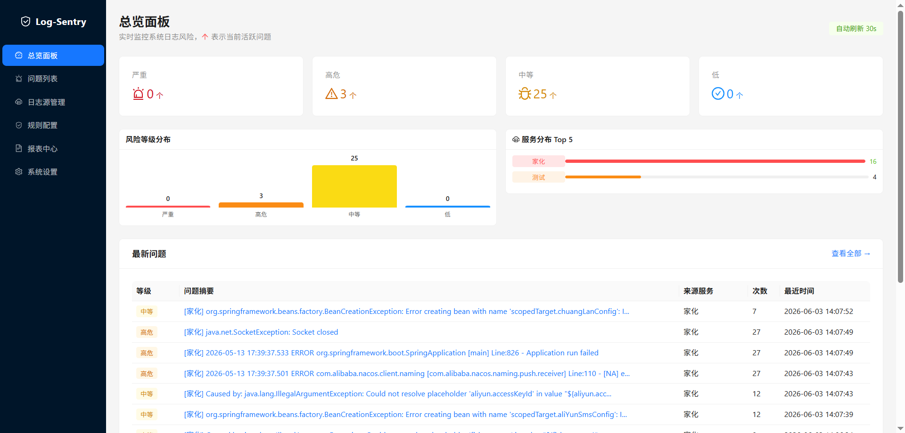
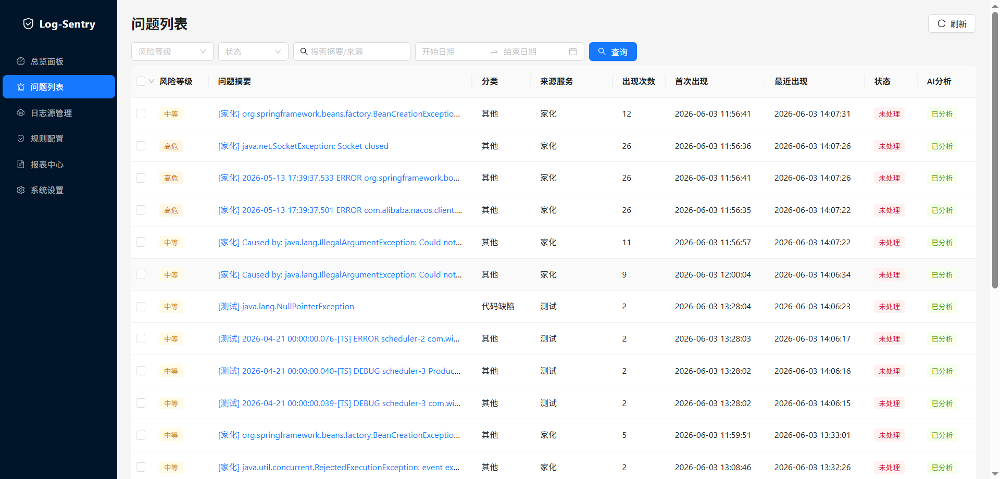
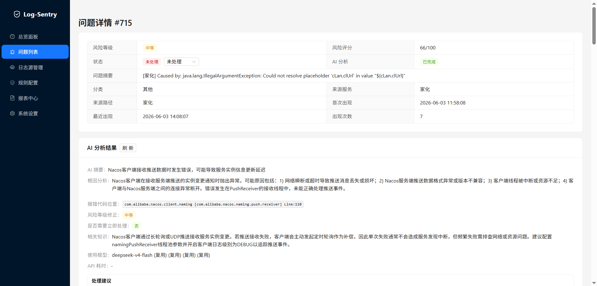
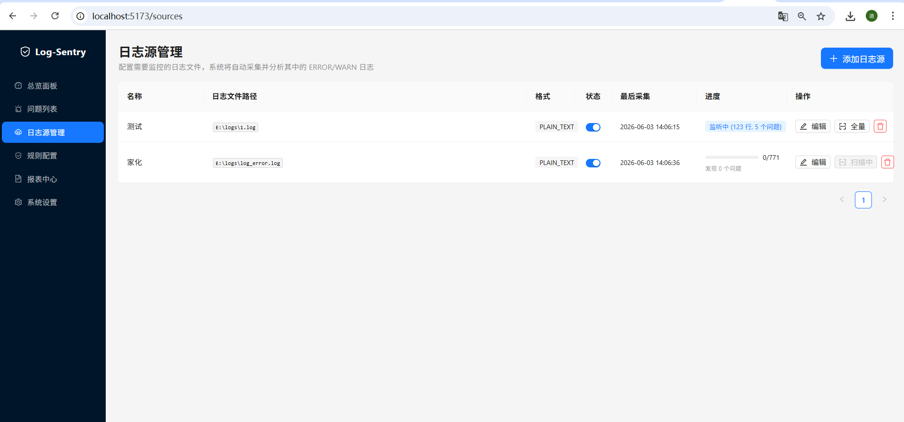

# Log-Sentry

**智能日志分析与风险告警平台** — 自动采集JAVA应用日志中的异常信息，通过规则引擎 + DeepSeek AI 双重分析，识别系统运行风险并生成处理建议。


> 仅采集 ERROR/WARN 级别日志，正常日志不存储，轻量高效。

---

## 特性

- **实时日志监听** — 类似 `tail -f`，毫秒级延迟捕获新增异常日志
- **全量历史扫描** — 首次接入已有日志文件时可一键全量分析，支持断点续扫
- **多格式解析** — 支持纯文本、JSON、Syslog、Logback 等常见日志格式
- **规则引擎** — 内置 OOM、连接超时、NPE、死锁等常见错误模式，支持自定义规则
- **DeepSeek AI 分析** — 高风险问题自动调用 AI 进行根因分析，生成结构化处理建议
- **风险评分** — 综合日志级别、出现频率、影响范围计算 0-100 风险分数
- **智能聚合** — 时间窗口内同类错误自动聚合，堆栈追踪行自动关联，避免告警风暴
- **报告生成** — 自动生成日报/周报/月报，支持 Markdown 导出
- **日志轮转支持** — 自动识别文件重命名/归档，无缝切换追踪

---

## 技术栈

| 层级 | 技术 | 版本 |
|------|------|------|
| 后端框架 | Spring Boot | 2.7.x |
| 前端框架 | React + Vite | React 19 / Vite 8 |
| UI 组件库 | Ant Design | 6.x |
| 数据库 | MySQL | 8.0 |
| 缓存 | Redis | 6.x |
| AI 服务 | DeepSeek API | deepseek-chat |
| HTTP 客户端 | OkHttp | 4.10 |
| 构建工具 | Maven / npm | 3.6+ / 18+ |

---

## 系统架构

```
┌─────────────────────────────────────────────────────────┐
│                   前端 (React + Ant Design)               │
│   Dashboard │ 问题列表 │ 问题详情 │ 报表中心 │ 系统配置    │
└────────────────────────┬────────────────────────────────┘
                         │ REST API
┌────────────────────────▼────────────────────────────────┐
│                  Spring Boot 后端                         │
│                                                          │
│  ┌──────────┐  ┌──────────┐  ┌────────┐  ┌──────────┐  │
│  │ 日志采集  │  │ 分析引擎  │  │ AI分析  │  │ 报告模块  │  │
│  └────┬─────┘  └────┬─────┘  └───┬────┘  └────┬─────┘  │
│       └──────────────┴────────────┴─────────────┘        │
│                    数据访问层 (Spring Data JPA)             │
└────────────────────────┬────────────────────────────────┘
                         │
         ┌───────────────┼───────────────┐
         │               │               │
    ┌────▼────┐    ┌─────▼─────┐   ┌─────▼─────┐
    │  MySQL  │    │   Redis   │   │ DeepSeek  │
    │ (数据)  │    │  (缓存)   │   │  (AI API) │
    └─────────┘    └───────────┘   └───────────┘
```

---

## 快速开始

### 环境要求

- Java 8+
- Node.js 18+
- MySQL 8.0
- Redis 6.x
- Maven 3.6+

### 1. 克隆项目

```bash
git clone https://github.com/your-username/log-sentry.git
cd log-sentry
```

### 2. 配置后端

编辑 `backend/src/main/resources/application.yml`：

```yaml
spring:
  datasource:
    url: jdbc:mysql://localhost:3306/log_sentry?useUnicode=true&characterEncoding=utf8&serverTimezone=GMT%2B8
    username: your_username
    password: your_password

  redis:
    host: localhost
    port: 6379

# DeepSeek API 配置
deepseek:
  api:
    key: your-api-key
    url: https://api.deepseek.com/chat/completions
    model: deepseek-chat
```

### 3. 启动后端

```bash
cd backend
mvn spring-boot:run
```

后端默认运行在 `http://localhost:8080`

### 4. 启动前端

```bash
cd frontend
npm install
npm run dev
```

前端默认运行在 `http://localhost:5173`，API 请求自动代理到后端。

---

## 项目结构

```
log-sentry/
├── backend/                          # 后端 (Spring Boot)
│   └── src/main/java/org/example/
│       ├── collector/                # 日志采集模块
│       │   ├── FileTailerService     #   文件尾随 (tail -f)
│       │   ├── FilePositionTracker   #   读取位置追踪
│       │   └── parser/              #   多格式解析器
│       ├── analyzer/                 # 分析引擎模块
│       │   ├── AnalysisEngine        #   分析调度主逻辑
│       │   ├── RuleMatcher           #   规则匹配
│       │   ├── RiskScorer            #   风险评分
│       │   └── LogAggregator         #   日志聚合
│       ├── ai/                       # AI 分析模块
│       │   ├── DeepSeekClient        #   DeepSeek API 客户端
│       │   ├── AiAnalyzer            #   AI 分析调度
│       │   ├── PromptBuilder         #   Prompt 构建
│       │   └── RateLimiter           #   API 限流
│       ├── report/                   # 报告模块
│       ├── controller/               # REST 接口
│       ├── service/                  # 业务服务
│       ├── repository/               # 数据访问 (JPA)
│       └── entity/                   # 实体类
├── frontend/                         # 前端 (React)
│   └── src/
│       ├── pages/
│       │   ├── Dashboard/            # 总览面板
│       │   ├── IssueList/            # 问题列表
│       │   ├── IssueDetail/          # 问题详情 + AI 分析
│       │   ├── LogSources/           # 日志源管理
│       │   ├── Rules/                # 规则配置
│       │   ├── Reports/              # 报表中心
│       │   └── Settings/             # 系统设置
│       ├── api/                      # API 请求封装
│       └── components/               # 公共组件
└── DESIGN.md                         # 详细设计文档
```

---

## 核心功能

### 日志采集

支持两种工作模式：

| 模式 | 说明 | 适用场景 |
|------|------|---------|
| **增量尾随** (默认) | 从文件末尾开始，只关注新写入的日志 | 服务已运行中，监控新错误 |
| **全量扫描** | 从文件头完整扫描，完成后自动切换增量 | 首次接入已有日志文件 |

性能特点：
- `RandomAccessFile.seek()` O(1) 定位，10GB+ 文件无性能问题
- 500ms 轮询间隔，单次增量通常 < 10ms
- 单次最大读取 5000 行，防止内存膨胀

### 分析引擎

```
日志采集 → 过滤(仅ERROR/WARN) → 规则匹配 → 风险评分 → 聚合去重
                                                         │
                                          风险 >= HIGH ───▼─── DeepSeek AI 深度分析
                                                         │
                                                    问题入库 + AI建议
```

### 风险等级

| 等级 | 分数 | 说明 | 示例 |
|------|------|------|------|
| 🔴 CRITICAL | 90-100 | 系统级故障，需立即处理 | OOM、磁盘满、主进程崩溃 |
| 🟠 HIGH | 70-89 | 严重问题，影响核心功能 | 连接池耗尽、频繁超时 |
| 🟡 MEDIUM | 40-69 | 需关注，存在潜在风险 | 偶发异常、性能下降 |
| 🔵 LOW | 0-39 | 一般信息，记录观察 | 配置警告、非关键错误 |

---

## API 接口

### 问题管理

| 方法 | 路径 | 说明 |
|------|------|------|
| GET | `/api/issues` | 分页查询问题列表 |
| GET | `/api/issues/{id}` | 获取问题详情(含 AI 分析) |
| PUT | `/api/issues/{id}/status` | 更新问题状态 |
| GET | `/api/issues/{id}/logs` | 获取关联原始日志 |

### 日志源管理

| 方法 | 路径 | 说明 |
|------|------|------|
| GET | `/api/sources` | 日志源列表 |
| POST | `/api/sources` | 创建日志源 |
| PUT | `/api/sources/{id}` | 更新配置 |
| POST | `/api/sources/{id}/full-scan` | 触发全量扫描 |
| GET | `/api/sources/{id}/scan-progress` | 查询扫描进度 |

### Dashboard

| 方法 | 路径 | 说明 |
|------|------|------|
| GET | `/api/dashboard/stats` | 统计数据 |
| GET | `/api/dashboard/recent` | 最近高风险问题 |
| GET | `/api/dashboard/trend` | 风险趋势 |

---

## 配置说明

```yaml
# 日志采集配置
log-sentry:
  collector:
    poll-interval: 500          # 轮询间隔 (ms)
    max-batch-lines: 5000       # 单次最大读取行数
    full-scan-batch-lines: 10000 # 全量扫描每批行数
    full-scan-batch-interval: 100 # 全量扫描批次间隔 (ms)
  ai:
    rate-limit-per-minute: 10   # AI API 每分钟调用上限
    cache-hours: 24             # AI 分析结果缓存时间
  aggregator:
    window-minutes: 5           # 同类错误聚合时间窗口
```

---

## 内置规则

系统预置以下常见错误检测规则，均可在前端自定义增删改：

| 规则 | 匹配模式 | 风险等级 |
|------|---------|---------|
| OutOfMemoryError | `java.lang.OutOfMemoryError` | CRITICAL |
| DiskSpaceLow | `No space left on device` | CRITICAL |
| ConnectionTimeout | `Connection.*timed?.*out` | HIGH |
| DatabaseDeadlock | `deadlock.*detected` | HIGH |
| NullPointerException | `NullPointerException` | HIGH |
| SlowQuery | `SlowQuery\|slow.*sql` | MEDIUM |

---

## 开发指南

### 后端开发

```bash
cd backend
mvn compile         # 编译
mvn test            # 测试
mvn spring-boot:run # 运行
```

### 前端开发

```bash
cd frontend
npm install         # 安装依赖
npm run dev         # 开发模式 (热更新)
npm run build       # 生产构建
npm run preview     # 预览构建结果
```

### 数据库

首次运行时 JPA 会自动建表（`ddl-auto: update`）。如需手动初始化，可参考 `backend/src/main/resources/schema.sql`。

---

## 部署

### Docker 部署（推荐）

```bash
# 构建后端
cd backend && mvn clean package -DskipTests

# 构建前端
cd frontend && npm run build

# 启动服务
docker-compose up -d
```

### 手动部署

1. 构建后端 JAR：`cd backend && mvn clean package -DskipTests`
2. 构建前端静态文件：`cd frontend && npm run build`
3. 将 `frontend/dist/` 放到 Nginx 或后端 static 目录
4. 运行：`java -jar backend/target/log-sentry-1.0-SNAPSHOT.jar`

---
### 部分演示



## License

MIT License

---

## 致谢

- [DeepSeek](https://www.deepseek.com/) — AI 分析能力支持
- [Ant Design](https://ant.design/) — 前端 UI 组件库
- [Spring Boot](https://spring.io/projects/spring-boot) — 后端框架
